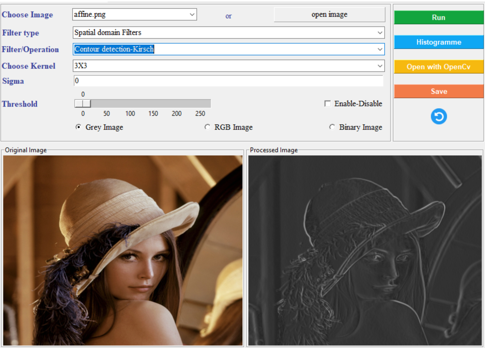
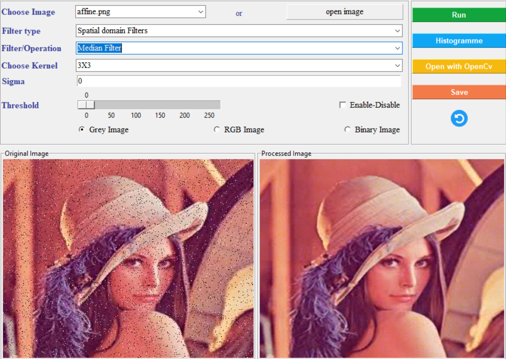
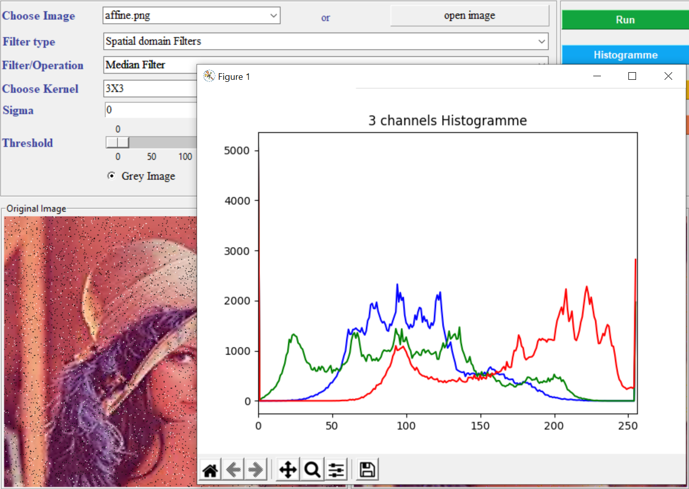
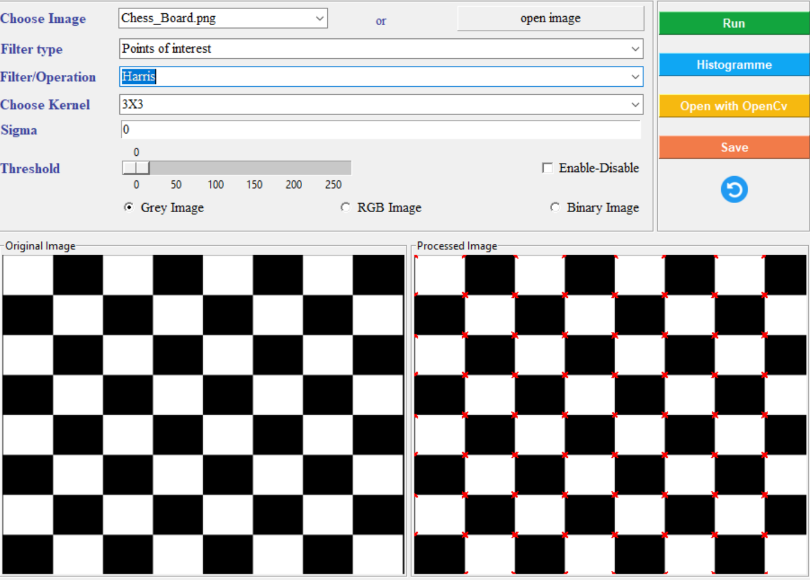

# Image-Processing
an implementation of different filters and operations on images using Numpy and little help from OpenCV and PILL
 ### -python 3.9
 ### -UI : tkinter
 ### -libraries : numpy , scipy , matplotlib , opencv , Pill
 # -filters / Operations
 #### -Elementary Transformation:
       ##### -Adjust Image Brightness
       ##### -Color inversion
       ##### -Gray Scale image
       ##### -Binarization by thresholding
       ##### -Gaussian-Noise
       ##### -Gaussian-Noise
       ##### -Poivre&Sel-Noise
       ##### -Contrast enhancement
#### -Spatial domain Filters:
       ##### -Median Filter
       ##### -Average Filter
       ##### -Gaussian Filter
       ##### -Contour detection-Laplacian
       ##### -Contour detection-Sobel
       ##### -Contour detection-Gradient
       ##### -Contour detection-Prewitt
       ##### -Contour detection-Roberts
       ##### -Contour detection-Laplacian-Gaussian
       ##### -Contour detection-Kirsch
       ##### -Contour detection-Canny
       
#### -Frequency domain filters:
       ##### -Contour detection-FFT High Pass :ideal
       ##### -image enhancement-FFT Band Pass :ideal
       ##### -image enhancement-FFT Low Pass
       ##### -Contour detection-Butterworth High Pass
       ##### -Butterworth Low Pass
       
 #### -Mathematical morphology:
       ##### -Erosion
       ##### -Dilation
       ##### -Opening
       ##### -Closing
       ##### -White Top Hat
       ##### -Black Top Hat
       ##### -Contour Detection Gradient
      
  #### -Corner and edge detection:
       ##### -Susan
       ##### -Harris
       ##### -Electrostatic model
       
  #Screen shots 
 
  
  
  
  
 
 
  
       
 
